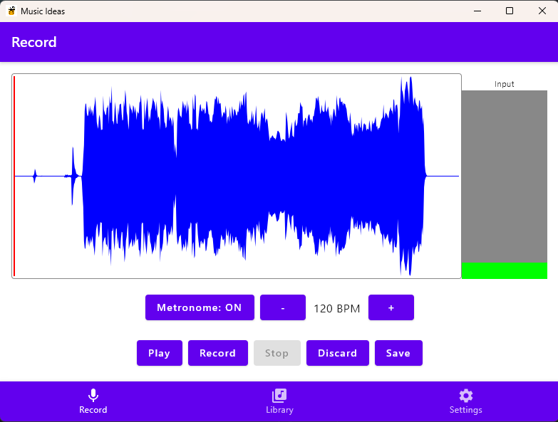
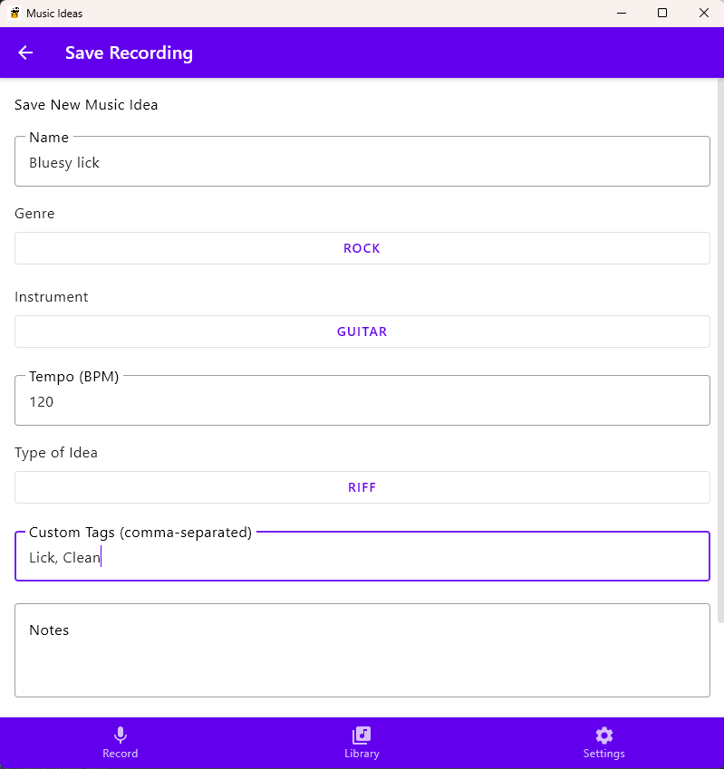
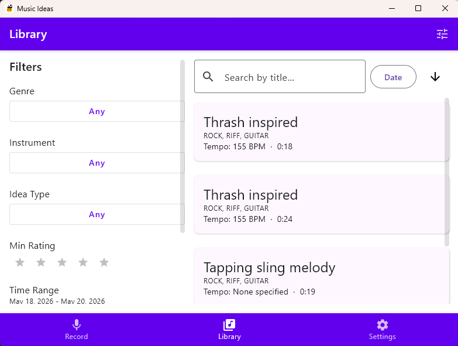

# MusicIdeas

A desktop app for musicians to quickly capture and tag audio ideas. Record a riff, attach metadata, browse your library, and export to MP3 — without getting in your way.

## Screenshots

 




## Requirements

- **Java 22** (Amazon Corretto 22 recommended)
- **Gradle** (wrapper included — no separate install needed)
- A working audio input device (microphone or audio interface)

## Building and running

There is an installation file for Windows in Releases. For running the latest version (or for Linux or MacOs), follow this guide:

Set `JAVA_HOME` before running Gradle (the JDK is not picked up from PATH automatically):

```powershell
$env:JAVA_HOME = "C:\Users\<you>\.jdks\corretto-22.0.2"
$env:PATH = "$env:JAVA_HOME\bin;$env:PATH"
```

```bash
./gradlew run        # Run the app
./gradlew build      # Compile and assemble
./gradlew package    # Build a native installer (MSI / DMG / DEB)
```

## Features

- **Record** audio from any input device with a live waveform and volume gauge
- **Metronome** with configurable BPM, tempo is stored with the recording
- **Library** — browse, search, filter, and sort all your recordings
  - Filter by genre, instrument, idea type, rating, date range, and tags
  - Sort by date, rating, duration, or BPM
  - Toggle which filter categories are visible via the tune icon in the title bar
- **Metadata** — title, genre, instrument, idea type, BPM, rating, tags, and free-text notes per recording
- **MP3 export** — export individual recordings to MP3
- **Drag and drop** — drag an audio file onto the app to import it into the library; drag a recording out to copy the file
- **Dark / light mode**
- **Configurable defaults** — set your preferred genre, instrument, and idea type in Settings so the save view is pre-filled

## Keyboard shortcuts

These shortcuts are active on the **Record** screen:

| Key | Action |
|-----|--------|
| `Space` | Start recording (if idle) / Stop recording (if recording) |
| `Enter` | Play recording |
| `Delete` / `Backspace` | Discard recording |
| `Escape` | Stop recording or stop playback |
| `Ctrl+S` | Save (opens the save screen) |

## Storage

Audio and metadata are stored locally in `~/MusicIdeas/` by default:

```
~/MusicIdeas/
  audio/      ← MP3 files (named by ID)
  metadata/   ← JSON files (one per recording)
```

The storage location can be changed in **Settings → Save Location**.

> **Note:** Restarting the app is required after changing the storage location.

### Sharing across devices with a cloud drive

Point the storage location at a folder inside your cloud drive (Dropbox, OneDrive, iCloud Drive, Google Drive, etc.) and both devices will share the same library automatically — as long as the cloud drive syncs the folder before you open the app on the other device.

**Steps:**

1. On the first device, go to **Settings → Save Location** and set it to a folder inside your cloud drive, e.g. `C:\Users\<you>\Dropbox\MusicIdeas` (Windows) or `~/Dropbox/MusicIdeas` (Mac/Linux).
2. Wait for the cloud drive to finish syncing.
3. On the second device, install the app and set **Settings → Save Location** to the same synced folder.
4. Restart the app on both devices after changing the location.

> **Caution:** Avoid recording on two devices simultaneously to the same folder — there is no conflict resolution, and simultaneous writes may corrupt metadata files.

## Settings

| Setting | Description |
|---------|-------------|
| Input Device | Which microphone or audio interface to record from |
| Audio Quality | Recording quality (Low / Medium / High) |
| Save Location | Where audio and metadata are stored on disk |
| Default Genre | Pre-fills the genre field on the save screen |
| Default Instrument | Pre-fills the instrument field on the save screen |
| Default Idea Type | Pre-fills the idea type field on the save screen |
| Dark Mode | Switch between dark and light theme |
